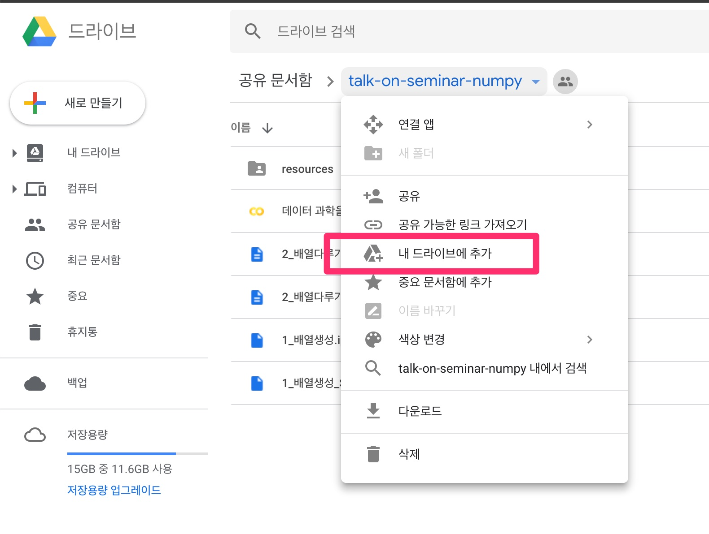

<!--  -->

# Python NumPy 기본기 다지기

- 온라인 강의 유튜브 재생목록: [링크](https://www.youtube.com/watch?v=zNrDbG4tNGo&list=PL9mhQYIlKEhf04ToiDFvNzKL0OP4W27TW)
- T아카데미 온라인 강의: [링크](https://tacademy.skplanet.com/live/player/onlineLectureDetail.action?seq=153)
- 학습자료: [링크](https://drive.google.com/drive/folders/1YoRBsCidaW6o9AIQtC3ymVgUQ_I7AWQE?usp=sharing)
- 질문: [sanghunka@gmail.com](mailto:sanghunka@gmail.com)

NumPy는 Pandas, Scikit-learn, Tensorflow등 데이터사이언스 분야에서 사용되는 라이브러리들의 토대가 되는 라이브러리입니다. NumPy 그 자체로는 데이터 분석 기능을 제공하지 않지만 NumPy를 활용해 데이터를 Python상에서 표현하고 다룰 줄 알아야만 데이터 분석이라는 그 이후 단계로 나아갈 수 있습니다.
이번 강의에서는 데이터 분석의 토대가 될 NumPy의 기본 기능들과 더 빠르고 효율적인 연산을 위한 NumPy활용법들을 다룰 예정입니다.

## 학습대상
- 기본적인 Python 프로그래밍과 행렬 연산이 가능하신 분

## 실습환경
- 공유된 [구글드라이브](https://drive.google.com/drive/folders/1YoRBsCidaW6o9AIQtC3ymVgUQ_I7AWQE?usp=sharing) 폴더를 `내 드라이브에 추가`한 뒤 Google Colab을 통해 실습을 진행합니다.

- 로컬환경에 실습환경이 구축되어 있다면 [github저장소](https://github.com/sanghunka/talk-on-seminar-numpy)를 클론해서 Jupyter notebook을 통해 실습을 진행해도 됩니다.

## 학습 내용
- NumPy개요
    - 데이터 과학에서 다차원 배열의 필요성
    - 파이썬 기본 자료형과 넘파이 자료형 구조 비교
- 다차원 배열 생성
    - 다차원 배열의 자료형 이해
    - 외부 데이터를 입력 받아 다차원 배열 생성하기
    - 0 / 1 / 랜덤값 다차원 배열 생성하기
- 다차원 배열 다루기
    - 메서드를 사용하여 통계값 구하기
        - 최대, 최소, 표준편차 등
    - 인덱싱
    - 슬라이싱
    - 전치(transpose)
    - 형태 변경(reshape, flatten, ravel)
    - 연결(concatenate)
- 다차원 배열간 연산
    - 합, 차, 곱, 나눗셈, 내적, 외적
- 브로드캐스팅과 벡터화 연산(vectorized operation)

## QnA
- [질문 및 답변 정리](./QnA/%EC%B6%94%EA%B0%80%20QnA.ipynb) 
- [stride관련 추가 설명](./QnA/%EC%B6%94%EA%B0%80%EC%A7%88%EB%AC%B8stride.pdf) 
- 강의 내용 관련 질문은 [메일](mailto:sanghunka@gmail.com) 보내주시면 답변드리겠습니다.

## Reference
- 사용한 이미지들의 출처는 실습자료에 출처가 명시되어 있습니다.
- [3_deep_learning_with_numpy.ipynb](./3_deep_learning_with_numpy.ipynb)는 coursera의 [machine learning](https://www.coursera.org/specializations/machine-learning-introduction)강의 자료를 참조했습니다.
